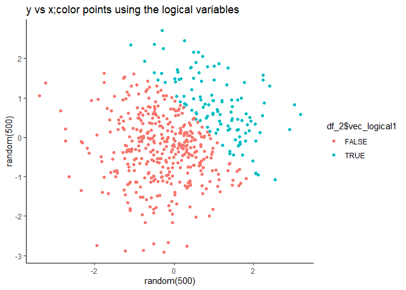
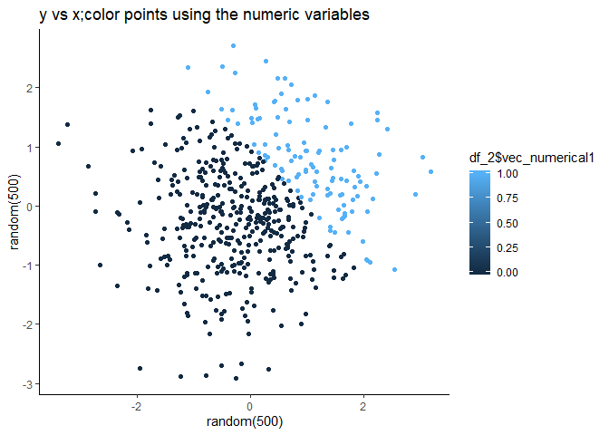

09.20 hw1
================
Guangling Xu
9/16/2019

## Set up

## Problem 1

``` r
df_1 = tibble(
   samp = rnorm(8),  
   # a random sample of size 8 from a standard Normal distribution  
   vec_logical = samp > 0, 
   #a logical vector indicating whether elements of the sample are greater than 0
   vec_char = c("This is R!"), 
   #a character vector of length 8
   vec_factor = factor(c("sun","rain","wind","wind","sun","rain","sun","rain")), 
   #a factor vector of length 8, with 3 different factor “levels”
  
)
```

## Take mean of each variable in the dataframe

  - Mean of random sample:

<!-- end list -->

``` r
mean(df_1$samp) ## works, data is numerical
```

    ## [1] -0.1277853

  - Mean of logical vector:

<!-- end list -->

``` r
mean(df_1$vec_logical) ## works, TRUE = 1 and FALSE = 0
```

    ## [1] 0.5

  - Mean of character
    vector:

<!-- end list -->

``` r
mean(df_1$vec_char) ## does not work,data is not numerical
```

    ## Warning in mean.default(df_1$vec_char): argument is not numeric or logical:
    ## returning NA

    ## [1] NA

  - Mean of factor
    vector:

<!-- end list -->

``` r
mean(df_1$vec_factor) ## does not work,data is not numerical
```

    ## Warning in mean.default(df_1$vec_factor): argument is not numeric or
    ## logical: returning NA

    ## [1] NA

``` r
as.numeric(df_1$samp) 
## works, random sample is composed of numeric data
as.numeric(df_1$vec_logical) 
## works, TRUE = 1 and FALSE = 0
as.numeric(df_1$vec_char) 
## characters cannot be transformed into numeric data
as.numeric(df_1$vec_factor) 
## The levels of a factor are stored as character data type, but transforming factor into numeric data is meaningless
```

## Convert data type

  - convert the logical vector to numeric,and multiply the random sample
    by the
    result

<!-- end list -->

``` r
(as.numeric(df_1$vec_logical)) *(df_1$samp) 
```

    ## [1] 0.00000000 0.00000000 0.00000000 0.11795739 0.50274486 0.20034913
    ## [7] 0.00000000 0.01808357

  - convert the logical vector to logical,and multiply the random sample
    by the
result

<!-- end list -->

``` r
(as.factor(df_1$vec_logical)) * (df_1$samp) ##factors cannot be multiplied
```

    ## Warning in Ops.factor((as.factor(df_1$vec_logical)), (df_1$samp)): '*' not
    ## meaningful for factors

    ## [1] NA NA NA NA NA NA NA NA

  - convert the logical vector to a factor and then convert the result
    to numeric, and multiply the random sample by the
    result

<!-- end list -->

``` r
(as.numeric(as.factor(df_1$vec_logical))) * (df_1$samp)
```

    ## [1] -0.04432775 -0.91138067 -0.54476790  0.23591477  1.00548972  0.40069825
    ## [7] -0.36094115  0.03616714

``` r
## numerics are 2,1,2,2,1,1,2,1
```

## Section 2

``` r
set.seed(1234)
df_2 = tibble(
  
  x = rnorm(500), ## a random sample of size 500 from a standard Normal distribution
  y = rnorm(500), ## a random sample of size 500 from a standard Normal distribution
  vec_logical1 = x + y > 1, ## a logical vector indicating whether x + y > 1
  vec_numerical1 = as.numeric(vec_logical1), ## a numeric vector created by coercing the above logical vector
  vec_factor1 = as.factor(vec_logical1), ## A factor vector created by coercing the above logical vector
  
)
```

## Calculate the size of the dataset and the mean, median, standard deviation of x and the proportion of cases for which x + y \> 1

  - Number of rows:

<!-- end list -->

``` r
nrow(df_2)
```

    ## [1] 500

  - Number of colums:

<!-- end list -->

``` r
ncol(df_2)
```

    ## [1] 5

  - Mean of x:

<!-- end list -->

``` r
mean(df_2$x)
```

    ## [1] 0.001838821

  - Median of x:

<!-- end list -->

``` r
median(df_2$x)
```

    ## [1] -0.02070734

  - Standard diviation of x:

<!-- end list -->

``` r
sd(df_2$x, na.rm = FALSE)
```

    ## [1] 1.034814

  - proportion of cases for which x + y \>
1:

<!-- end list -->

``` r
sum(df_2$vec_logical1 == TRUE) / (sum(df_2$vec_logical1 == FALSE) + sum(df_2$vec_logical1 == TRUE))
```

    ## [1] 0.232

# Make a scatterplot

``` r
ggplot(df_2, aes(x = x,y = y,color = df_2$vec_logical1,)) + geom_point()+
  labs(title="y vs x;color points using the logical variables", x="random(500)", y = "random(500)")+
  theme_classic()  
```

<!-- -->

``` r
ggsave("Scatter plot1 for hw1.pdf")
```

    ## Saving 7 x 5 in image

``` r
ggplot(df_2, aes(x = x,y = y,color = df_2$vec_numerical1,)) + geom_point()+
  labs(title="y vs x;color points using the numeric variables",
x="random(500)", y = "random(500)")+
  theme_classic()  
```

<!-- -->

``` r
ggsave("Scatter plot2 for hw1.pdf")
```

    ## Saving 7 x 5 in image

``` r
ggplot(df_2, aes(x = x,y = y,color = df_2$vec_factor1,)) + geom_point()+
  labs(title="y vs x;color points using the factor variables",
       x="random(500)", y = "random(500)")+
  theme_classic() 
```

<!-- -->

``` r
ggsave("Scatter plot3 for hw1.pdf")
```

    ## Saving 7 x 5 in image
